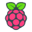

# Hello, I'm Derek Sheen 👋

## Who Am I?
Hello! I'm Derek, a student with a passion for software development. 

I love to program and am skilled with many object-oriented programming languages such as Java and Python. I believe that critical and creative thinking is just one of the many important traits in the workforce that I am always trying to work on. I'm always open to learning new skills and participating in opportunities that can make positive impacts locally or globally. I'm always open to meeting new people and learning new things!

### Skills
##### Programming Languages

 

#####  Databases

 

#####  Tools/Frameworks

 

##### IoT

 

##### Operating Systems

 

## Hobbies/Interests
- American football 🏈
- Basketball 🏀
- Chess ♛
- Hackathons 💻
- Drawing ✏️
- Violin 🻠 

## GitHub Stats

 

## Current Projects
- Game Development 🎮
- Astronomy + CS @ MIT 🔭
* Most repositories private

## Contacts
For business inquiries or connecting
- Email: derek.s.prog@gmail.com
- Personal website: https://dereksheen.tech/

<!--
**derek-byte/derek-byte** is a ✨ _special_ ✨ repository because its `README.md` (this file) appears on your GitHub profile.

Here are some ideas to get you started:

- 🔭 I’m currently working on ...
- 🌱 I’m currently learning ...
- 👯 I’m looking to collaborate on ...
- 🤔 I’m looking for help with ...
- 💬 Ask me about ...
- 📫 How to reach me: ...
- 😄 Pronouns: ...
- ⚡ Fun fact: ...
-->
